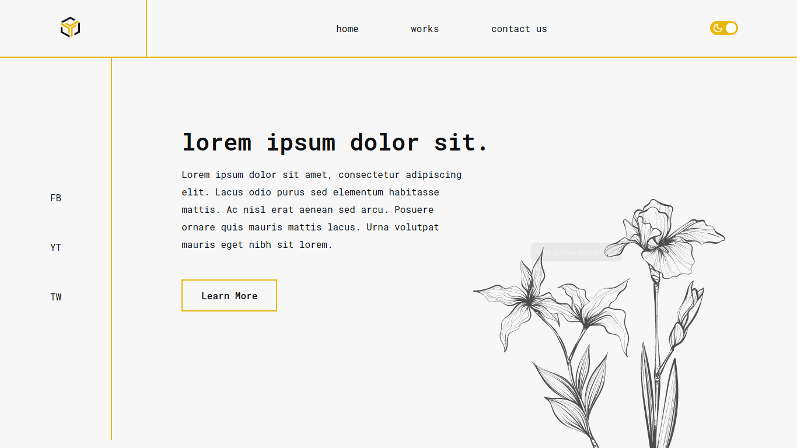
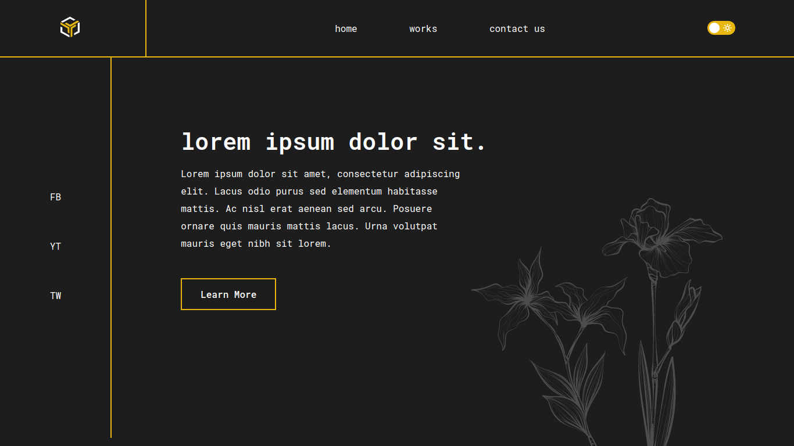

<h1> UI & CSS PROJECT :bulb:</h1> 
<h3> Personal project developed to practice my CSS and Interface Design. </h3> 

<h2> THE UI :art: </h2> 

For this project, I wanted a minimalist but modern design with a technological vibe. I couldn't reach the initial result I had in mind, but I really liked the result I got at the end.
 

<h2> THE CODE :computer: </h2>

In CSS, I tried to do something that used some properties other than the defaults and simple elements that I'm used to, like the position for positioning the yellow lines, the nth-child to be able to manipulate the logo colors according to light or dark mode, and I also created a dark mode option on the project, changed by a personalized toggle button. 
 

 
 
<h3> :raising_hand: Autora
 
 
   
 <b>Redes Sociais</b> 
  

 

---

Dsenvolvido por Vitória Lopes 👋🏻 [Entre em contato!](https://www.linkedin.com/in/vilopesp/)
